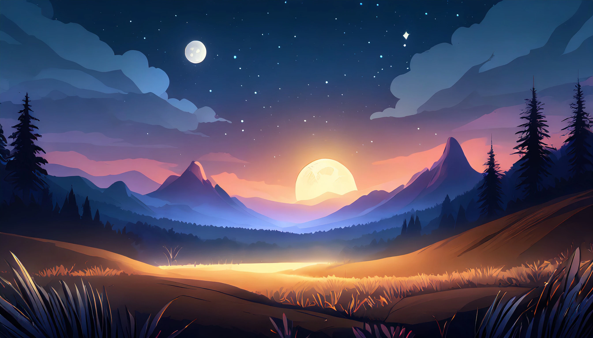
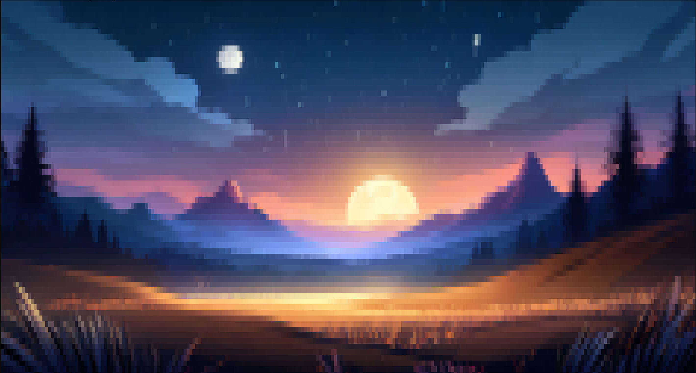

# Examples

### Scenic Valley

This example was from a random wallpaper I grabbed off google and if you ask me the ansified version looks ready to be put into some sort of terminal adventure game :)

You can test this for yourself aswell by cloning this repository and running [main.go](./main.go)

### Before

### After

